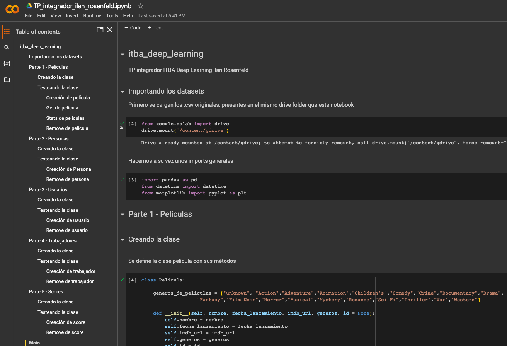

# itba_deep_learning
TP integrador ITBA Deep Learning Ilan Rosenfeld

### Index

1. [Notebook](#notebook)

2. [Datasets](#datasets)

3. [Clases](#clases)

4. [Main](#main)

5. [Estado y Pendientes](#estado-y-pendientes)

## Notebook

Para interactuar con el código directamente y de manera más simple, se disponibilizó un Google Colab Notebook. El mismo se encuentra en el siguiente link: https://colab.research.google.com/drive/1iBOE7OfBtzEvm-mGtN1FyDboVVr7goR5?authuser=3#scrollTo=GOmXHWAOvku0

Preview (tiene menú incluido):


## Datasets

Dentro de [datasets/](datasets/) encontrarán los 5 csv originales de las entidades (personas, peliculas, scores, trabajadores, usuarios)

## Clases

Se definieron 5 clases, una por entidad, representadas por scripts .py:
1. [persona.py](persona.py)
2. [pelicula.py](pelicula.py)
3. [trabajador.py](trabajador.py)
4. [usuario.py](usuario.py)
5. [score.py](score.py)

Cada una de ellas posee ademas un main al final para ejecutar los distintos test cases de los métodos implementados. Ejemplo, para probar los métodos de persona, se debe correr el siguiente comando:

```
$ python -W ignore persona.py
```

## Main

La clase [main.py](main.py) contiene el código necesario para cargar todos los csv a dataframes y asimismo guardar los dataframes como csv

## Estado y Pendientes

El siguiente es el avance y los pendientes del trabajo:

Pelicula:
- Alta: OK
- Baja: OK
- Stats: OK
- *Pending*: volver la fecha al formato original para guardar en csv

Scores:
- Alta: OK TODO al agregar score validar que existe peli y persona
- Baja: OK
- Stats: pendientes: Puntuación promedio de usuario(s) por año(de película)/género. Puntuación promedio de películas por género de usuario(sexo)/rango etáreo/Ocupación.

Personas:
- Alta: OK
- Baja: OK
- Stats: OK

Usuarios: 
- Alta: OK
- Baja: OK
- Stats: OK

Trabajadores:
- Alta: OK
- Baja: Ok
- Stats: OK

